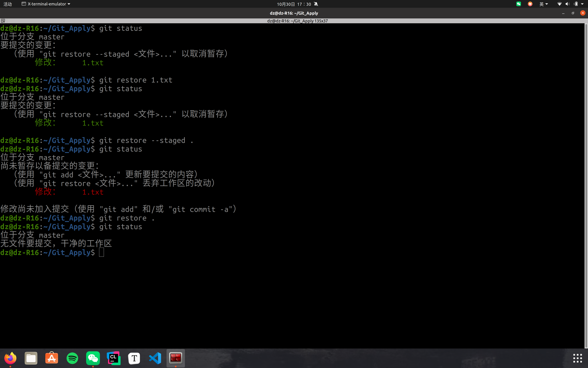
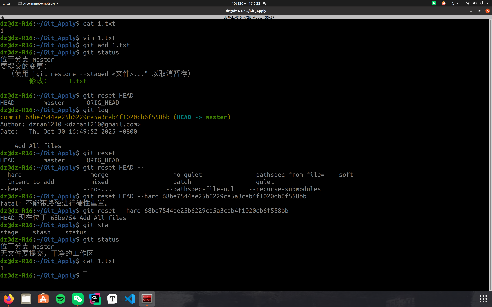
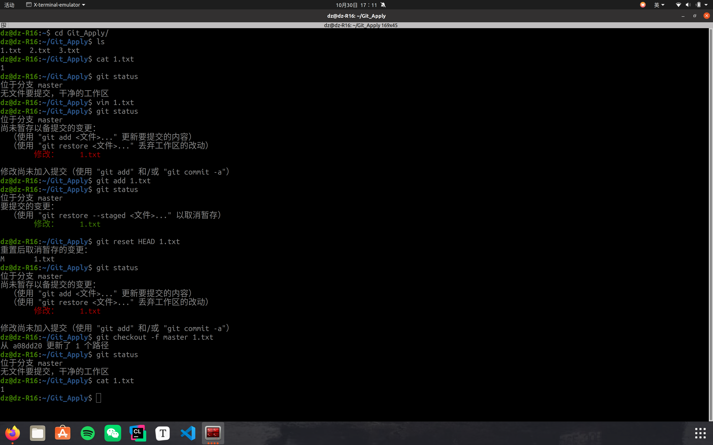
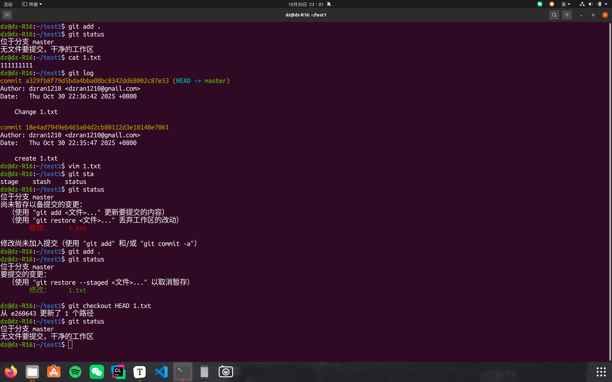
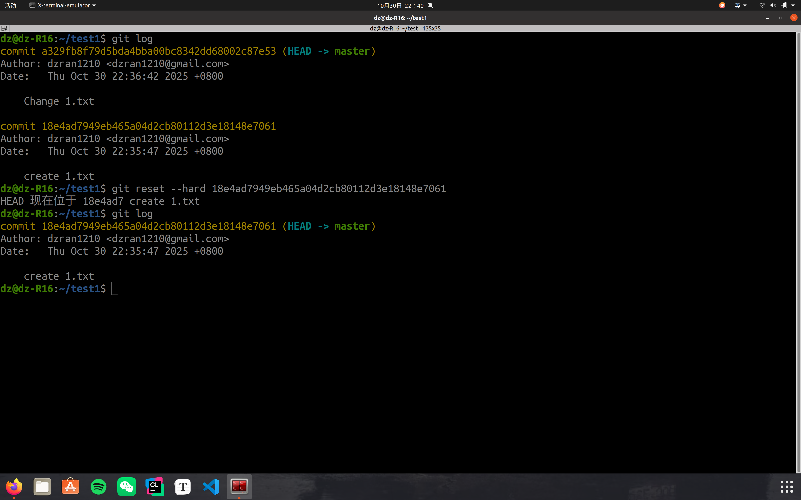
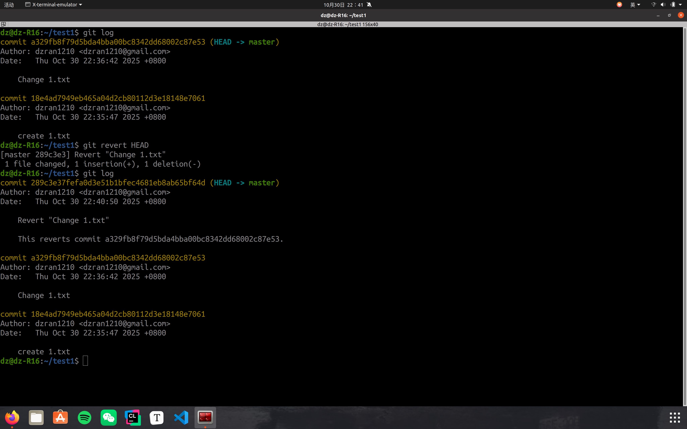
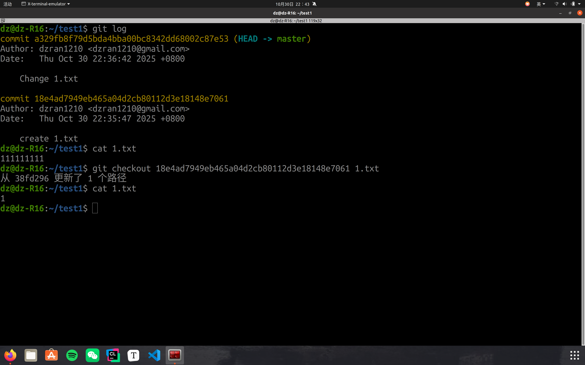
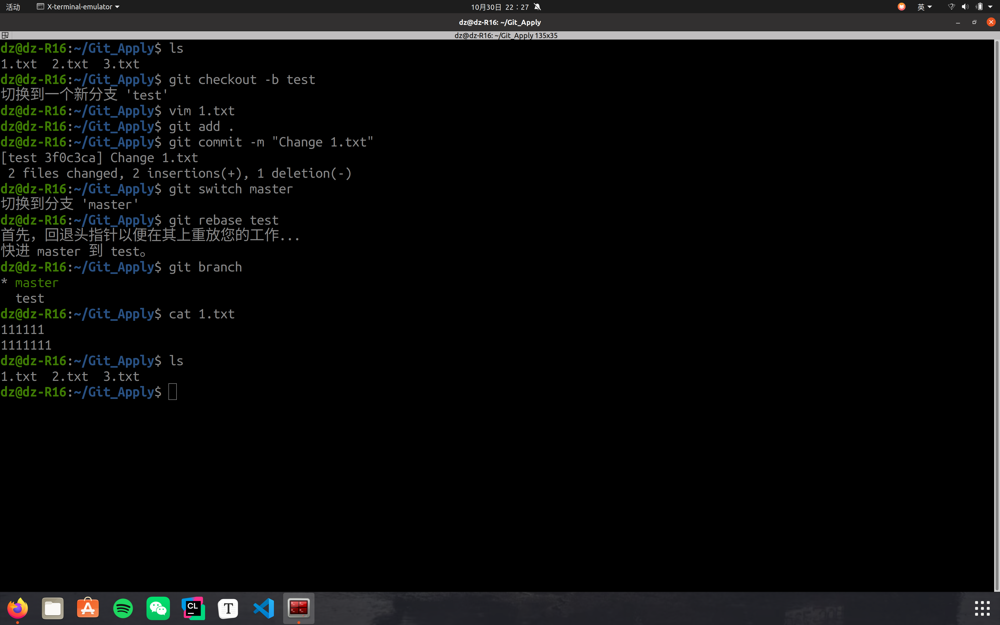
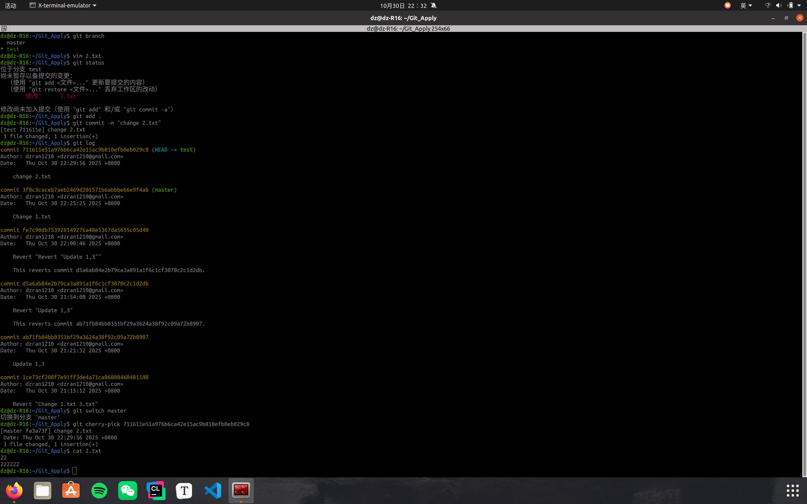

# Git的应用

***一、若你已经修改了部分文件、并且将其中的一部分加入了暂存区，应该如何回退这些修改，恢复到修改前最后一次提交的状态？给出至少两种不同的方式***

1. **git restore --staged File（或者全部“.”)**

​		restore 恢复到之前的状态

​		--staged 暂存类

​	**git restore File**

​		恢复工作区的指定文件的状态

2. **git reset --hard HEAD**

​		reset 会退版本

​		-hard 不保留暂存区和工作区（soft保留工作区）

​		直接就是会退到当前提交

3. **git checkout id --File**

   

***二、若你已经提交了一个新版本，需要回退该版本，应该如何操作？分别给出不修改历史或修改历史的至少两种不同的方式***

1. **git reset --hard id**

   ​	reset 会退版本

   ​	--hard 不保留暂存区和工作区（soft保留工作区）

   ​	id 版本号（也可以是分支指针和当前指针HEAD，还有\^1,\^2或者～1，～2。。。）

   

2. **git revert id**

​		revert 撤销当前版本id的提交，建立最新提交

3. **git checkout id --File**

   ​	checkout 切换至id版本，将现在File版本切换为id对应的版本
   
   

***三、我们已经知道了合并分支可以使用 merge，但这不是唯一的方法，给出至少两种不同的合并分支的方式***

1. **rebase变基操作**

2. **cherry-pick**

